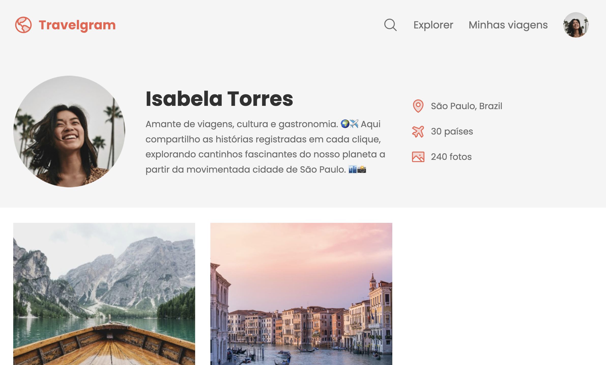

<h1 align="center">📄 Projeto Travelgram</h1>

  Segundo projeto de front-end para praticar estruturação HTML e estilizações básicas com CSS.

  <a href="#-tecnologias">Tecnologias</a>&nbsp;&nbsp;&nbsp;|&nbsp;&nbsp;&nbsp;
  <a href="#-projeto">Projeto</a>&nbsp;&nbsp;&nbsp;|&nbsp;&nbsp;&nbsp;
  <a href="#-aprendizados">Aprendizados</a>&nbsp;&nbsp;&nbsp;|&nbsp;&nbsp;&nbsp;
  <a href="#memo-licença">Licença</a>

 

  

## 🚀 Tecnologias

Esse projeto foi desenvolvido com:

- HTML5
- CSS3
- Figma

## 💻 Projeto

Esse projeto é uma página simples criada como parte do meu processo de aprendizado em front-end. Foi meu segundo contato com estruturação HTML e estilização com CSS.

## 📚 Aprendizados

Nesse projeto, eu trabalhei com:

- Estrutura HTML básica
- Estilizações com CSS
- Fontes personalizadas
- Espaçamentos com `margin` e `padding`
- Inserção de imagens no layout
- Listas desordenadas com `<ul>` e `<li>`

## :memo: Licença

Esse projeto está sob a licença MIT.  

